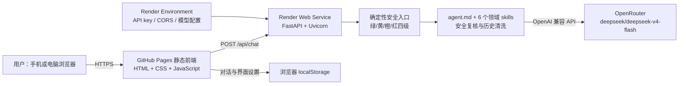

# 结项技术文档

> 项目：留学生情绪梳理 Agent  
> 团队：北京师范大学 AI Agent 课程第6组  
> 文档版本：1.1
> 更新日期：2026-07-14

## 1. 项目概述

本项目面向身处跨文化学习环境的留学生，在室友互动、小组讨论、社交落差与孤独等日常情境中提供低门槛的情绪梳理。系统不做心理诊断，也不替代专业帮助；核心交互是先共情与澄清，再帮助用户形成一个小而可执行的下一步。

- 前端：https://bnu-ai-agent-class.github.io/6/
- 后端：https://bnu-agent-6.onrender.com
- 健康检查：https://bnu-agent-6.onrender.com/api/health
- 代码仓库：https://github.com/BNU-AI-Agent-Class/6

## 2. 技术架构



浏览器端不含模型密钥。请求先经过后端的确定性安全判断，再决定直接返回黄/橙/红灯回复、确定性边界回应，或调用模型生成普通绿灯回应。模型输出再由独立请求复核；复核缺凭据、超时、空内容或非 JSON 时按 fail-closed 丢弃原回复。当前源码为 3.4.0 本地候选版，公网仍需部署后复验。

## 3. 技术选型与理由

| 层 | 选型 | 理由 |
|---|---|---|
| 前端 | 单文件 HTML/CSS/JavaScript | 零构建、部署简单、适合 GitHub Pages 与移动浏览器 |
| 后端 | Python FastAPI + Uvicorn | 结构清晰、Pydantic 契约明确，便于实现确定性安全护栏 |
| 模型访问 | HTTPX + OpenRouter | 兼容 OpenAI 风格接口，模型可配置且密钥只留后端 |
| 前端部署 | GitHub Pages | 免费 HTTPS 静态托管，与课程仓库直接对应 |
| 后端部署 | Render Web Service | 成功从课程公开仓库构建 FastAPI，支持环境变量与公网 HTTPS |
| 数据状态 | 浏览器 localStorage | 不建立服务端用户数据库，降低课程原型的身份数据负担 |

## 4. 核心接口与数据流

### `GET /api/health`

用于部署探活与前后端版本握手。本地 3.4.0 候选版返回 `status=ok`、`version=3.4.0` 与 `has_key`，但不返回真实密钥。历史公网记录为 3.3.1；部署完成前不得把公网写成 3.4.0。

### `POST /api/chat`

请求仅接收 `user` 与 `assistant` 历史消息；客户端 `system` 角色会被拒绝。前端每次发送当前会话历史，可选自我描述也作为消息随请求发送；后端不提供用户档案或长期记忆写入接口。紧急帮助按钮额外发送 `emergency_help=true`，后端不调用模型、不依赖关键词，直接进入二级红灯转介。
响应包含：

- `reply`：展示给用户的回复；
- `is_crisis`：是否进入明确危机路径；
- `escalation_level`：0、2 或 3；
- `safety_light`：green、yellow、orange 或 red；
- `stage`：当前处理阶段；
- `model`：本轮使用的模型或 `safety` / `safety-review` / `fallback`。

前端在每次聊天前调用健康检查核对后端版本，避免旧后端继续处理新规则下的消息。

## 5. 安全、隐私与人本设计

### 5.1 密钥与权限

- 模型 key 只保存在 Render Environment，前端和 Git 仓库均为零 key。
- `.env` 被 `.gitignore` 排除；`.env.example` 只包含占位符。
- CORS 生产 origin 限制为 `https://bnu-ai-agent-class.github.io`。

### 5.2 危机护栏

- 入口：确定性正则与语境排除规则区分普通倾诉、被动死亡愿望、明确意图和迫近危险；紧急帮助按钮使用独立布尔信号确定性进入红灯。
- 红灯：明确本人当前自伤/自杀/伤人意图立即停止普通对话，转介身边真人、当地紧急服务和全国统一心理援助热线 12356。
- 黄灯：只做一次最小化安全确认，不追问方法或计划细节。
- 出口：独立请求同时检查最新用户原话与模型回复；可补捉入口遗漏的风险。复核不可用时 fail-closed，不发送未经复核的原回复。
- 历史：旧危机回复不会污染新的普通消息判断。

### 5.3 AI 身份与隐私披露

首屏明确说明系统是 AI、不能替代专业心理或医疗帮助。每次发送时，所选会话会经过本项目后端并交给其配置的模型服务商生成回复；本地副本保存在当前浏览器。这不是端到端加密。产品不要求真实身份，并提醒用户不要输入敏感个人信息。普通删除先进入本地回收站；设置中可永久清空回收站，或永久清除全部本地对话与设置。删除只影响当前浏览器，不能撤回服务商已处理的既往请求。

### 5.4 优雅降级

后端睡眠、断网、模型错误或版本不匹配时，前端捕获异常并显示可读兜底，不展示堆栈、不白屏。普通断线保持中性；明确危机断线仍显示真人支持、当地紧急服务和 12356。

## 6. 部署说明

### 6.1 前端：GitHub Pages

主分支源码为 `frontend/index.html`，发布时将同一内容同步到 `gh-pages` 分支根目录的 `index.html`；CRLF/LF 换行差异不影响部署。GitHub Pages 从 `gh-pages` 分支提供线上页面。

线上环境固定调用 `https://bnu-agent-6.onrender.com`；当页面从 `localhost`、`127.0.0.1` 或 `file:` 打开时，自动使用 `http://localhost:8000` 便于本地调试。

### 6.2 后端：Render

| 项目 | 配置 |
|---|---|
| Branch | `main` |
| Root Directory | `backend` |
| Build Command | `pip install -r requirements.txt` |
| Start Command | `uvicorn main:app --host 0.0.0.0 --port $PORT` |
| Instance | Free |

Render Environment 变量：

- `OPENROUTER_API_KEY`：必填、敏感；
- `CORS_ORIGINS=https://bnu-ai-agent-class.github.io`；
- `LLM_MODEL=deepseek/deepseek-v4-flash`；
- `LLM_BASE_URL=https://openrouter.ai/api/v1`；
- `SAFETY_REVIEW_MODEL`：可选；单独指定出口复核模型，留空时使用 `LLM_MODEL` 的独立请求；
- `PORT` 由 Render 自动注入，不手工填写。

当前仓库通过公开 Git 地址克隆；后端代码更新后，在 Render 执行 **Manual Deploy → Deploy latest commit**，再检查 Events、Logs 与 `/api/health`。

## 7. 复现步骤

```powershell
git clone https://github.com/BNU-AI-Agent-Class/6.git
cd 6\backend
Copy-Item .env.example .env
# 编辑 .env：仅在本机填写 OPENROUTER_API_KEY
pip install -r requirements.txt
uvicorn main:app --host 127.0.0.1 --port 8000
```

另开终端：

```powershell
cd 6\frontend
python -m http.server 5500
```

访问 http://127.0.0.1:5500/。本地测试命令：

```powershell
cd backend
python -m unittest -v test_safety.py
python run_t7_matrix.py
cd ..\frontend
node test_frontend_contract.js
node test_b4_e2e.js
```

## 8. 验收证据

### 8.1 当前 3.4.0 本地候选版

| 项目 | 结果 |
|---|---|
| 后端安全回归 | 38 tests PASS，0 FAIL |
| T7 API 矩阵 | 26/26 PASS，退出码 0；完整原始输出见 `evidence/T7_3.4.0_本地实测.json` |
| 前端合同检查 | PASS；覆盖 Render URL、AI 身份、完整数据流、永久删除、12356、紧急按钮信号与 3.4.0 握手 |
| 本地浏览器 E2E | PASS；桌面普通对话与紧急按钮、断网双降级、390×844 移动端聊天与布局均通过 |
| Python 语法检查 | `main.py` 与 `run_t7_matrix.py` 通过 |
| 公网 3.4.0 | **待部署、待健康检查/CORS/E2E/真机复验** |

### 8.2 历史公网 3.3.1 验收记录

| 项目 | 历史结果 |
|---|---|
| Render 健康检查 | HTTP 200，版本 3.3.1，`has_key=true` |
| 普通与危机请求 | HTTP 200；绿灯普通对话与红灯紧急按钮通过 |
| CORS | 允许 GitHub Pages origin |
| 浏览器 E2E | 普通对话、紧急按钮、断网双降级与 390×844 移动视口通过 |
| 真机 | 两台手机普通对话；紧急按钮显示真人、当地紧急服务与 12356 |
| 密钥扫描 | 历史记录显示前端、已提交仓库与 Git 历史无真实 key 模式；本地 `.env` 保持未跟踪 |

历史 3.3.1 结果不能替代 3.4.0 的部署后复验。当前尚不提交、不推送，也未修改 Render 或 GitHub Pages。
## 9. 已知限制与运维建议

- Render Free 实例空闲后会休眠，首次请求可能出现明显冷启动；演示前先访问健康检查预热。
- 临时课程 key 预计于 2026-07-18 失效；到期后应从 Render Environment 与本地 `.env` 清理，并按需要更换有效 key 或停止服务。
- 这是课程原型，不提供诊断、治疗、持续监护或紧急救援。
- 模型仍可能生成不理想内容，确定性护栏不能替代真实专业人员。
- 对话会发送给后端及模型服务商；不适合输入姓名、证件、联系方式等敏感身份信息。
- localStorage 属于设备本地存储；共用设备应在使用后使用“永久清空回收站”或“永久清除全部本地对话与设置”。
- 当前无账号、跨设备同步、服务端持久化和后台人工接管功能。
- 若需要在中国境内长期稳定访问，应评估腾讯云或阿里云；通常需要实名、备案及少量费用。

## 10. 团队与交付物

- 团队：北京师范大学 AI Agent 课程第6组
- 仓库提交者：Sandrone
- 课程：人本 AI 设计与创新
- 课程指导：郑先隽，北京师范大学心理学部
- 主要交付：T1–T8、前后端源码、测试用例、检查清单、部署卡、结项技术文档、云端原型与展示材料。
